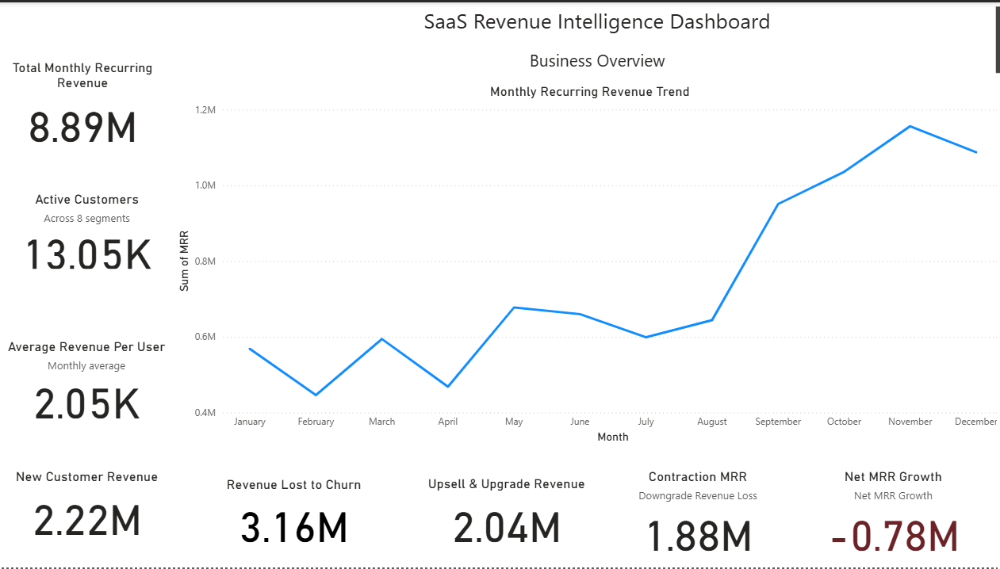
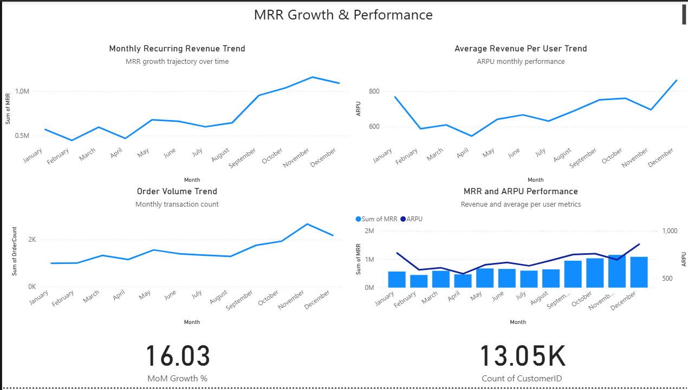
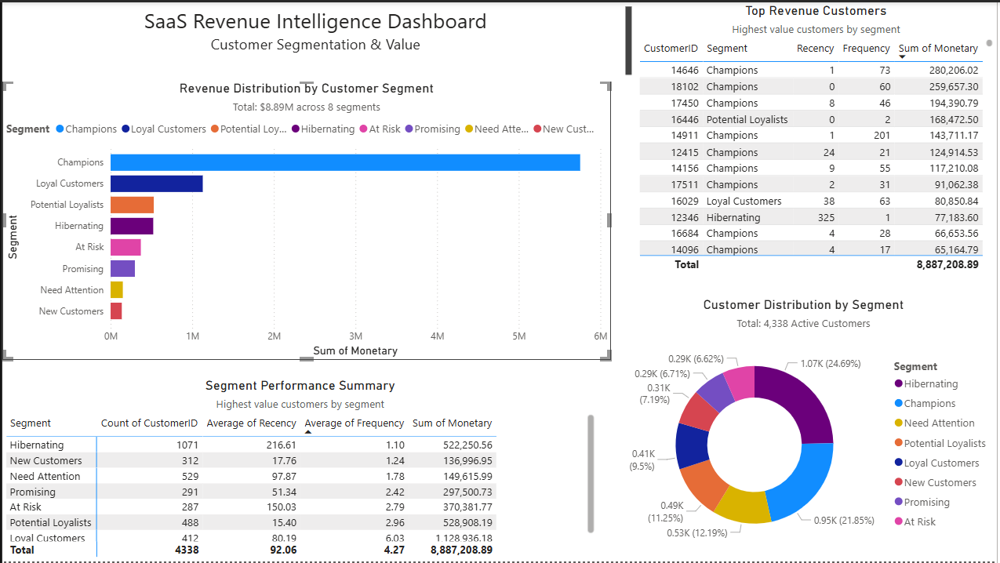
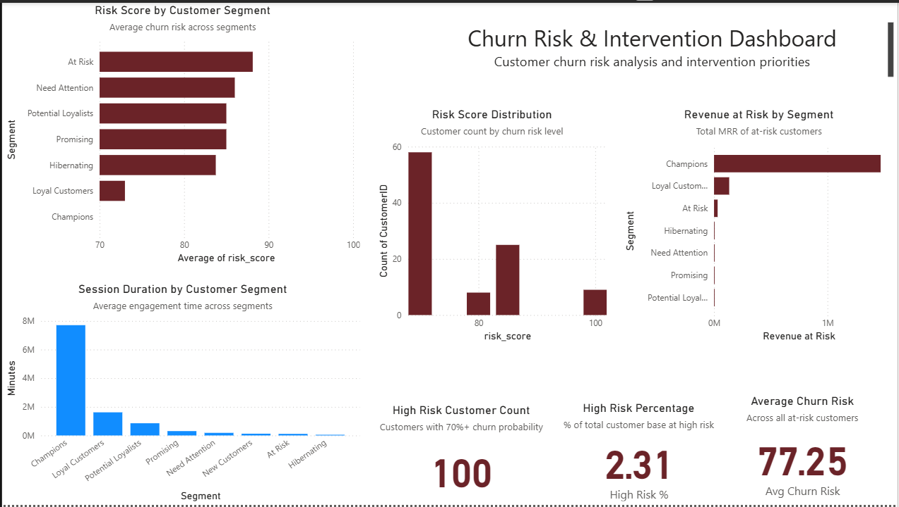
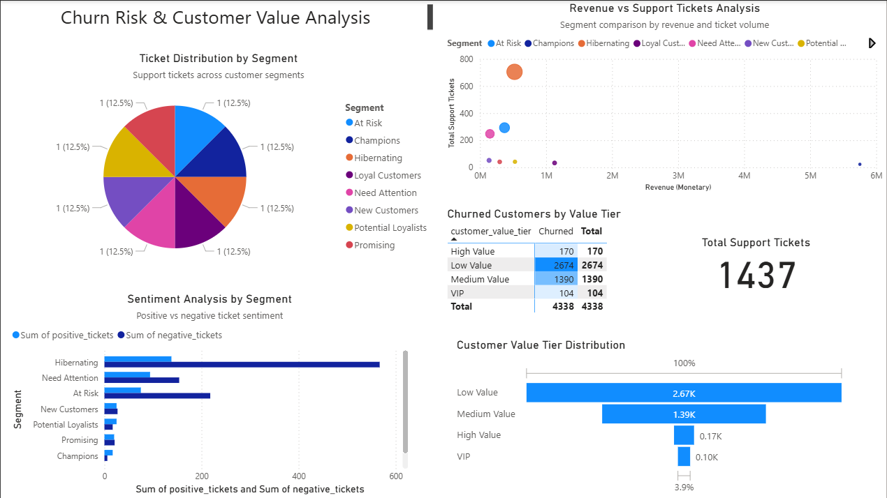
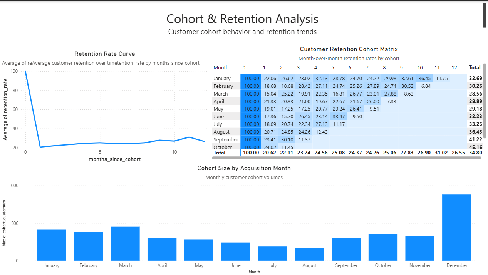
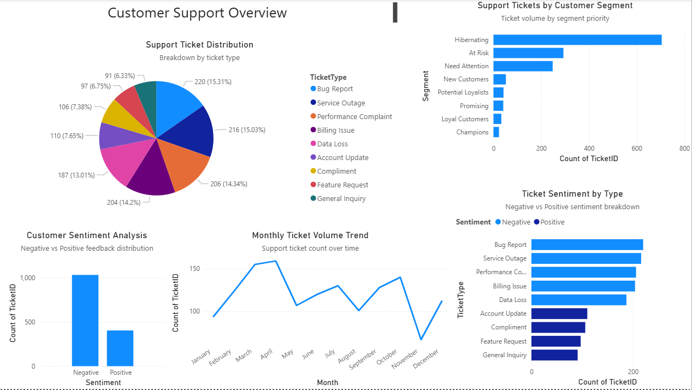

# SaaS Revenue Intelligence Dashboard

**End-to-end data analytics pipeline transforming UCI Online Retail data into actionable SaaS subscription insights through Python ETL, PostgreSQL, and Power BI dashboards.**

[](https://www.python.org/)
[](https://www.postgresql.org/)
[](https://powerbi.microsoft.com/)

---

## Table of Contents

- [Project Overview](#project-overview)
- [Business Problem](#business-problem)
- [Tech Stack](#tech-stack)
- [Key Features](#key-features)
- [Dashboard Results](#dashboard-results)
- [Dataset](#dataset)
- [Project Architecture](#project-architecture)
- [Installation and Setup](#installation-and-setup)
- [Project Structure](#project-structure)
- [Data Pipeline](#data-pipeline)
- [SQL Analytics](#sql-analytics)
- [Power BI Dashboards](#power-bi-dashboards)
- [Key Insights](#key-insights)
- [Future Enhancements](#future-enhancements)
- [Author](#author)

---

## Project Overview

This project demonstrates a complete SaaS analytics solution by transforming the UCI Online Retail dataset into a subscription-based revenue intelligence system. The pipeline includes data cleaning, SaaS-specific transformations, **synthetic data generation for support tickets and usage logs**, PostgreSQL analytics, and interactive Power BI dashboards tracking MRR, customer segmentation, churn risk, and cohort retention.

**Project Type:** Portfolio / Data Engineering & Analytics  
**Domain:** SaaS Revenue Intelligence  
**Status:** Complete & Production-Ready

**Important Note:** Support ticket and usage log data were **synthetically generated** to simulate a realistic SaaS environment, demonstrating data generation capabilities and ensuring comprehensive analytics coverage.

---

## Business Problem

SaaS companies face critical challenges in understanding revenue dynamics:

- **Revenue Leakage:** Identifying where MRR growth stalls (churn vs contraction vs expansion)
- **Customer Value:** Segmenting customers by behavior to prioritize retention efforts
- **Churn Prediction:** Proactively identifying at-risk customers before they cancel
- **Cohort Performance:** Tracking retention rates across customer cohorts
- **Support Analytics:** Correlating support tickets with churn risk

This project addresses these challenges with a data-driven approach.

---

## Tech Stack

| **Category** | **Technologies** |
|-------------|-----------------|
| **Languages** | Python 3.11, SQL (PostgreSQL) |
| **Data Processing** | pandas, NumPy |
| **Database** | PostgreSQL 16.0 (via Podman container) |
| **Visualization** | Power BI Desktop |
| **Version Control** | Git, GitHub |
| **Environment** | Jupyter Notebook |

---

## Key Features

- **ETL Pipeline:** Complete data transformation from e-commerce to SaaS subscription model
- **MRR Growth Accounting:** Tracks New, Expansion, Contraction, and Churn MRR
- **RFM Segmentation:** 8-tier customer segmentation (Champions, Loyal, At Risk, etc.)
- **Churn Risk Scoring:** Predictive churn model with 0-100 risk scores
- **Cohort Analysis:** Month-over-month retention tracking
- **Synthetic Data Generation:** Support tickets and usage logs created to simulate SaaS operations
- **SQL Views:** Pre-calculated metrics for dashboard performance
- **Interactive Dashboards:** 7 Power BI dashboards with drill-down capabilities

---

## Dashboard Results

### Quick Stats from Actual Dashboards

| **Metric** | **Value** | **Dashboard** |
|-----------|----------|--------------|
| Total MRR | $8.89M | Business Overview |
| Active Customers | 13,050 | Business Overview |
| ARPU | $2,050/month | Business Overview |
| MoM Growth | 16.03% | MRR Growth |
| Net MRR Growth | -$0.78M | Business Overview |
| High-Risk Customers | 100 (2.31%) | Churn Risk |
| Avg Churn Risk Score | 77.25 | Churn Risk |
| Total Customers Analyzed | 4,338 | Customer Segmentation |
| Support Tickets | 1,437 | Support Overview |
| Month 1 Retention | 20-25% | Cohort Retention |

---

## Dataset

**Source:** [UCI Machine Learning Repository - Online Retail Dataset](https://archive.ics.uci.edu/ml/datasets/Online+Retail)

**Original Data:**
- 541,909 transactions
- UK-based retailer (2010-2011)
- Gift items and household products

**Transformations Applied:**
1. Data cleaning (removed nulls, negatives, duplicates)
2. SaaS conversion (invoices → subscriptions)
3. MRR calculation based on transaction amounts
4. RFM scoring for customer segmentation
5. **Synthetic support ticket generation** (1,437 tickets across segments)
6. **Synthetic usage log generation** (session data by customer)
7. Churn risk modeling

---

## Project Architecture

```
UCI Online Retail Dataset
          ↓
    [Python ETL]
    - Data cleaning
    - SaaS transformation
    - Synthetic data generation
          ↓
   [PostgreSQL Database]
    - 5 Tables (transactions, subscriptions, customers, support, usage)
    - 5 Views (MRR growth, cohort, segmentation, churn, support)
          ↓
    [Power BI Dashboards]
    - 7 interactive dashboards
    - Real-time filtering
    - Cross-visual interactions
```

---

## Installation and Setup

### Prerequisites

- Python 3.11+
- PostgreSQL 16.0 (or Podman/Docker for containerized setup)
- Power BI Desktop
- Git

### Step 1: Clone Repository

```bash
git clone https://github.com/yourusername/SaaS-Revenue-Intelligence-Dashboard.git
cd SaaS-Revenue-Intelligence-Dashboard
```

### Step 2: Install Python Dependencies

```bash
pip install pandas numpy psycopg2-binary jupyter
```

### Step 3: Setup PostgreSQL

**Option A: Using Podman (Recommended)**
```bash
podman run --name postgres-saas -e POSTGRES_PASSWORD=yourpassword -p 5432:5432 -d postgres:16
```

**Option B: Local PostgreSQL Installation**
- Install PostgreSQL from [official website](https://www.postgresql.org/download/)
- Create database named `saas_analytics`

### Step 4: Run ETL Notebook

```bash
jupyter notebook notebooks/SaaS_ETL_Pipeline.ipynb
```

Execute all cells to:
1. Load and clean data
2. Transform to SaaS model
3. Generate synthetic support/usage data
4. Load to PostgreSQL

### Step 5: Open Power BI Dashboards

1. Open Power BI Desktop
2. Get Data → PostgreSQL
3. Connect to `localhost:5432/saas_analytics`
4. Import all tables and views
5. Load existing dashboards from `dashboards/` folder

---

## Project Structure

```
SaaS-Revenue-Intelligence-Dashboard/
│
├── data/
│   ├── raw/
│   │   └── Online_Retail.csv
│   └── processed/
│       ├── transactions.csv
│       ├── mrr_subscriptions.csv
│       ├── customer_analysis.csv
│       ├── support_tickets.csv (synthetic)
│       └── usage_logs.csv (synthetic)
│
├── notebooks/
│   └── SaaS_ETL_Pipeline.ipynb
│
├── sql/
│   ├── create_tables.sql
│   └── create_views.sql
│
├── dashboards/
│   ├── Business_overview.png
│   ├── MRRGrowth.png
│   ├── Customer_segmentation_and_value.png
│   ├── Churn_risk_and_intervention.png
│   ├── Churn_risk_and_cva.png
│   ├── Cohort_and_Retention.png
│   └── Customer_support_overview.png
│
└── README.md
```

---

## Data Pipeline

### Phase 1: Data Cleaning
- Remove null CustomerIDs and negative quantities
- Filter out cancelled orders
- Convert InvoiceDate to datetime
- Handle outliers in UnitPrice

### Phase 2: SaaS Transformation
- Convert transactions to monthly subscriptions
- Calculate MRR per customer
- Assign subscription start/end dates
- Track MRR growth components (New, Expansion, Contraction, Churn)

### Phase 3: Customer Segmentation
- RFM analysis (Recency, Frequency, Monetary)
- 8-tier segmentation:
  - Champions
  - Loyal Customers
  - Potential Loyalists
  - Promising
  - Need Attention
  - At Risk
  - Hibernating
  - New Customers

### Phase 4: Synthetic Data Generation
- **Support Tickets:** Generated 1,437 tickets with segment-based sentiment distribution
- **Usage Logs:** Created session data correlated with customer value tiers
- Both datasets designed to reflect realistic SaaS patterns

### Phase 5: Churn Risk Modeling
- Risk score calculation (0-100)
- Based on recency, frequency, and monetary decline
- Identifies customers needing intervention

---

## SQL Analytics

### 5 Core SQL Views

1. **`mrr_growth_view`**
   - Tracks New, Expansion, Contraction, Churn MRR
   - Month-over-month growth rates
   - Used in MRR Growth dashboard

2. **`customer_segmentation_view`**
   - RFM scores and segment assignments
   - Customer lifetime value
   - Revenue distribution by segment

3. **`cohort_retention_view`**
   - Month-over-month retention rates
   - Cohort size and performance
   - Retention curves by acquisition month

4. **`churn_risk_view`**
   - Customer risk scores
   - At-risk revenue quantification
   - Intervention priority ranking

5. **`support_analytics_view`**
   - Ticket volume by segment
   - Sentiment analysis
   - Support correlation with churn

---

## Power BI Dashboards

### 1. Business Overview


**Key Metrics:**
- Total MRR: $8.89M
- Active Customers: 13,050
- ARPU: $2,050
- Net MRR Growth: -$0.78M (negative growth indicating leaky bucket)

**Components:**
- New Customer Revenue: $2.22M
- Revenue Lost to Churn: $3.16M
- Upsell & Upgrade: $2.04M
- Contraction MRR: $1.88M

---

### 2. MRR Growth & Performance


**Metrics:**
- MoM Growth Rate: 16.03%
- Customer Count: 13,050

**Insights:**
- 13-month MRR trajectory showing growth
- Order volume correlation with MRR
- ARPU monthly performance trends

---

### 3. Customer Segmentation & Value


**Summary:**
- Total Customers: 4,338
- Total Revenue: $8.89M across 8 segments

**Distribution:**
- Champions: 9.5% (highest value)
- Loyal Customers: 21.85%
- Hibernating: 24.69% (largest segment - reactivation opportunity)
- At Risk: 6.71%
- Need Attention: 12.19%

---

### 4. Churn Risk & Intervention


**Critical Metrics:**
- High-Risk Customers: 100 (70%+ churn probability)
- High-Risk Percentage: 2.31% of base
- Average Churn Risk: 77.25

**Analysis:**
- Risk score distribution by segment
- Revenue at risk by customer tier
- Session duration by segment (Champions: 8M minutes)

---

### 5. Churn Risk & Customer Value Analysis


**Support Correlation:**
- Total Tickets: 1,437
- Churned customers by value tier
- Sentiment analysis by segment (Hibernating: 78% negative)

**Value Tier Distribution:**
- Low Value: 2.67K customers
- Medium Value: 1.39K customers
- High Value: 0.17K customers
- VIP: 0.10K customers

---

### 6. Cohort & Retention Analysis


**Retention Curve:**
- Month 0: 100% (baseline)
- Month 1: 20-25% (dramatic drop - activation problem)
- Stabilizes at 25-30% after Month 3

**Cohort Performance:**
- Largest cohort: December (800+ customers)
- Smallest cohorts: July-August (~200 customers)
- Month 12 retention varies: 11.75% - 32.69%

---

### 7. Customer Support Overview


**Ticket Metrics:**
- Total Tickets: 1,437
- Hibernating segment: 53% of tickets
- Negative sentiment: 70%+

**Ticket Type Distribution:**
- Bug Report: 15.31%
- Service Outage: 15.03%
- Performance Complaint: 14.34%
- Billing Issue: 14.22%
- Data Loss: 13.01%

---

## Key Insights

### 1. Revenue Leakage Problem
- **Net MRR Growth: -$0.78M** despite 16% growth rate
- Churn ($3.16M) exceeds new customer revenue ($2.22M)
- Indicates "leaky bucket" requiring immediate retention focus

### 2. Activation Crisis
- **75-80% churn within first month**
- Not a retention problem, but an activation problem
- Requires onboarding improvements and early engagement strategies

### 3. High-Value Customer Risk
- **100 customers at 70%+ churn risk**
- Champions segment represents majority of at-risk revenue
- Requires immediate CSM intervention and win-back campaigns

### 4. Support-Churn Correlation
- **Hibernating segment generates 53% of tickets**
- 78% negative sentiment in this segment
- Support ticket volume predicts churn risk

### 5. Segment Opportunities
- **Hibernating: 24.69% of customers** (largest segment)
- Massive reactivation opportunity
- Targeted campaigns could unlock significant revenue

---

## Future Enhancements

- **Predictive Churn Model:** Machine learning model using logistic regression or XGBoost
- **Real-Time Dashboards:** Automated ETL with Apache Airflow
- **Customer Health Score:** Composite metric combining engagement, support, and financial health
- **Automated Alerts:** Email/Slack notifications for high-risk customers
- **API Integration:** REST API for dashboard data access
- **A/B Testing Framework:** Track retention experiment results
- **Advanced Cohort Analysis:** Multi-dimensional cohorts (by plan, geography, source)

---

## Author

**Shriram Sutraye**  
📧 Email: [shriramsutraye@gmail.com](mailto:shriramsutraye@gmail.com)  
💼 LinkedIn: [linkedin.com/in/shriramraoss](https://www.linkedin.com/in/shriramraoss/)  
🔗 GitHub: [github.com/yourusername](https://github.com/yourusername)

---

## License

This project is open-source and available for educational and portfolio purposes.

---

## Acknowledgments

- **Dataset:** UCI Machine Learning Repository
- **Inspiration:** SaaS metrics frameworks by ChartMogul and ProfitWell
- **Tools:** Python, PostgreSQL, Power BI communities

---

**⭐ If you found this project helpful, please consider starring the repository!**
